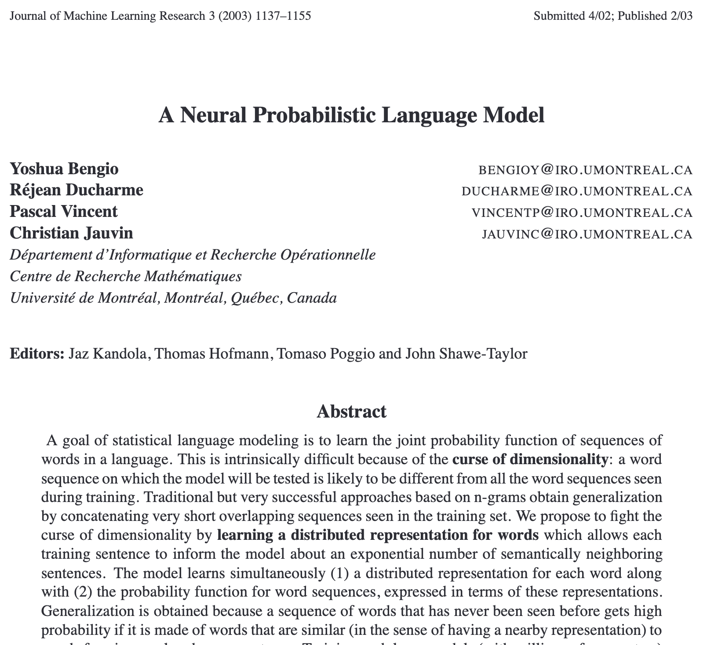
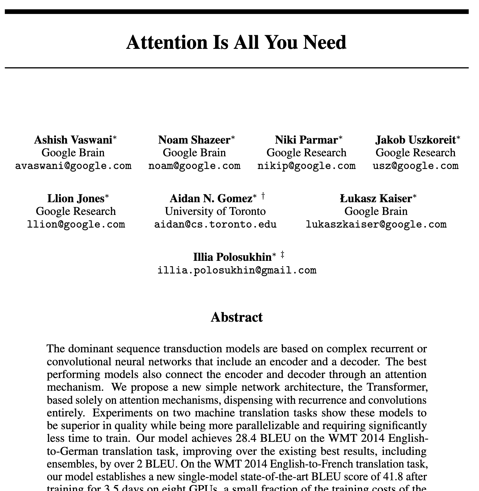

# Outline
<!-- type: content -->

0.  Language models
1.  Tokenization
2.  Embeddings
3.  Multi-layer perceptron (MLP)
4.  Self-attention
5.  Blocks
6.  (Decoder) Transformer
7.  Autoregressive generation

# 0. Language models {#0-language-models}
<!-- type: content -->

> A **language model** takes a text and predicts the next
word.

<br>
This notion was introduced and discussed already in the 1960s!

<br>
Intrinsically, language modeling is a **stochastic** task: the model outputs a probabilistic distribution.

# 1. Tokenization {#1-tokenization}
<!-- type: content -->

<u>First step</u>: we need to decompose texts into basic units:
<br>

- **Characters**: hard to capture semantics
- **Words**: too many, doesn't capture similarities (long / longer /
  longest)
- **Tokens**: somewhere between characters and words (rule of thumb: 1
  word ≈ 4 tokens)

The set of tokens is called the **vocabulary**. Each token is mapped to an integer ID.

## Examples
<!-- type: example -->

```{python}
import tiktoken

enc = tiktoken.get_encoding("gpt2")

words = [
    "king", "queen", "man", "woman", "dog", "cat",
]

for w in words:
    ids = enc.encode(w)
    print(f"{w!r:12} -> token ids {ids}")
```

::: {.callout-note}
Some words correspond to a single token. Each model has a different tokenizer, here we use GPT-2's tokenizer based on the BPE algorithm.
:::

## Examples
<!-- type: example -->

```{python}
text = "Transformers are all you need!"
token_ids = enc.encode(text)
print(f"Text: {text!r}")
print(f"Token IDs: {token_ids}")
print(f"Tokens: {[enc.decode([t]) for t in token_ids]}")
print(f"Vocabulary size: {enc.n_vocab}")
```

**Bottom line**: at this point, we have converted text into a sequence
of integers.

---

<!-- type: content -->

:::{.paper}

:::

## Quiz: Tokenization
<!-- type: quiz -->
<!-- answer: B -->
<!-- explanation: The rule of thumb is 1 word ≈ 4 tokens for English text. This means the vocabulary of tokens is smaller than the vocabulary of words, while still capturing subword structure (e.g. "running" → "run" + "ning"). -->

**Question**: Which of the following best describes the relationship between words and tokens in English text?

A) 1 word = exactly 1 token — every word maps to one token.

B) 1 word ≈ 4 tokens — tokens are subword units smaller than words.

C) 1 word ≈ 1/4 token — tokens group multiple words together.

D) There is no predictable relationship between words and tokens.

# 2. Embeddings {#2-embeddings}
<!-- type: content -->

In Machine Learning, we distinguish between **discrete** (**sparse**) and **continuous** (**dense**) representations.

<br>

The <u>key idea</u>: represent each token as a vector in a vector space, called the **latent space**.

## Example
<!-- type: example -->

Concretely, an **embedding matrix** maps each token into a dense vector.

<br>

```{python}
import torch
from transformers import GPT2Model

model = GPT2Model.from_pretrained("gpt2")
model.eval()

E = model.wte.weight.detach().numpy()
print(f"Embedding matrix: {E.shape}")
print(f"Example embedding for 'king': {E[enc.encode('king')].mean(axis=0)[:5]} ...")
```

## A 3D visualization of the latent space
<!-- type: example -->

We are using PCA for dimensionality reduction.

```{python}
#| echo: false
import plotly.graph_objects as go
import numpy as np
from sklearn.decomposition import PCA

words = [
    "king", "man", "woman",
    "dog", "wolf", "fox",
    "milk", "butter", "cheese",
    "car", "train", "city",
]

# On prend la moyenne des embeddings de chaque mot
X = np.array([E[enc.encode(w)].mean(axis=0) for w in words])  # shape : (len(words), 768)
pca = PCA(n_components=3, random_state=42)
X3 = pca.fit_transform(X)

categories = {
    "kingdom" : ["king", "man", "woman"],
    "animal" : ["dog", "wolf", "fox"],
    "food": ["milk", "butter", "cheese"],
    "location"    : ["car", "train", "city"],
}

colors = {
    "kingdom" : "#7F77DD",
    "animal" : "#1D9E75",
    "food": "#EF9F27",
    "location"    : "#888780",
}

word_to_cat = {w: cat for cat, ws in categories.items() for w in ws}

fig = go.Figure()

for cat, ws in categories.items():
    idx = [words.index(w) for w in ws]
    fig.add_trace(go.Scatter3d(
        x=X3[idx, 0], y=X3[idx, 1], z=X3[idx, 2],
        mode="markers+text",
        name=cat,
        text=ws,
        textposition="top center",
        textfont=dict(size=12),
        marker=dict(size=7, color=colors[cat], opacity=0.9),
    ))

fig.update_layout(
    scene=dict(
        xaxis_title=f"PC1",
        yaxis_title=f"PC2",
        zaxis_title=f"PC3",
    ),
    legend=dict(itemsizing="constant"),
    margin=dict(l=0, r=0, t=30, b=0)
)

fig.show()
```

## The linear representation hypothesis
<!-- type: content -->

> Concepts and relationships are encoded as directions in the latent space

. . .

What do these operations have in common?

* emb(`Man`) - emb(`Woman`)
* emb(`King`) - emb(`Queen`)
* emb(`Actor`) - emb(`Actress`)

. . .

They all represent the same concept: the *gender* direction.

## Cosine similarity
<!-- type: content -->

The cosine similarity between two vectors $x$ and $y$ is defined as:
$$\text{sim}(x, y) = \frac{x \cdot y}{\|x\| \|y\|}$$

. . .

It measures how similar two vectors are in terms of direction, regardless of their magnitude.

. . .

This is how we measure similarity in the latent space.

## Some examples
<!-- type: example -->

```{python}
from sklearn.metrics.pairwise import cosine_similarity

def word_embedding(word):
    ids = enc.encode(word)
    return E[ids].mean(axis=0, keepdims=True)

pairs = [
    ("man",   "woman"),
    ("dog",    "philosophy"),
    ("banana", "car"),
]

print(f"{'Word 1':<10} {'Word 2':<10} {'Cosine similarity':>18}")
print("-" * 42)
for w1, w2 in pairs:
    sim = cosine_similarity(word_embedding(w1), word_embedding(w2))[0, 0]
    print(f"{w1:<10} {w2:<10} {sim:>18.4f}")
```

## Some statistics
<!-- type: content -->

  Model              Embedding dim
  ------------------ ---------------
  GPT-2 small        768
  GPT-3              12,288
  Llama 3 (largest)  16,384

## Key takeaway so far
<!-- type: content -->

We have discussed the first two steps:

* The text (prompt) is decomposed into **tokens**, which are represented by integers.
* Each token is mapped into a **dense vector**.

> The actual input of the model is a sequence of dense vectors, representing the sequence of tokens.

. . .

The next step is to understand how the model processes these vectors to generate the next token.

## Quiz: From text to model input
<!-- type: quiz -->
<!-- answer: C -->
<!-- explanation: The correct pipeline is: raw text → split into tokens (subword units) → each token gets an integer ID → each integer is looked up in the embedding matrix to produce a dense vector. The actual input of the Transformer is therefore a sequence of dense vectors. -->

**Question**: Which sequence correctly describes the pipeline from raw text to Transformer input?

A) Text → Dense vectors → Tokens → Integers

B) Text → Integers → Tokens → Dense vectors

C) Text → Tokens → Integers → Dense vectors

D) Text → Tokens → Dense vectors → Integers

# 3. Multi-Layer Perceptron (MLP) {#3-MLP}
<!-- type: content -->

An MLP is a simple feedforward neural network, consisting of a sequence of layers.

. . .

<br>

Each layer consists of a set of neurons, where:

* Each neuron receives inputs of all the neurons from the previous layer, and computes a weighted sum of its inputs.
* Each neuron then applies a non-linear activation function, and produces an output.

## Activation functions
<!-- type: content -->

The classical activation function is ReLU (Rectified Linear Unit), defined as:
$$\text{ReLU}(x) = \max(0, x)$$

We say that a neuron is activated if its output is positive, and inactive if its output is zero.

## Logits
<!-- type: content -->

The output of the MLP is a vector of **logits**, which are unnormalized scores for each token in the vocabulary.

<br>

We apply a softmax function to the logits to get a **probability distribution over the vocabulary**, which we can sample from to generate the next token:

$$\text{softmax}(\alpha)_{i,j} = \frac{\exp(\alpha_{i,j})}{\sum_{j'} \exp(\alpha_{i,j'})}$$

## Illustration of an MLP


## An MLP language model
<!-- type: example -->

```python
class MLPLanguageModel(nn.Module):
    def __init__(self, vocab_size, embed_dim, hidden_dim):
        super().__init__()
        self.embed = nn.Embedding(vocab_size, embed_dim)
        self.fc1   = nn.Linear(embed_dim, hidden_dim)
        self.fc2   = nn.Linear(hidden_dim, vocab_size)

    def forward(self, token_ids):
        # token_ids : (batch, seq_len)
        x = self.embed(token_ids)      # (batch, seq_len, embed_dim)
        x = self.fc1(x)                # (batch, seq_len, hidden_dim)
        x = F.relu(x)                  # (batch, seq_len, hidden_dim)
        x = self.fc2(x)                # (batch, seq_len, vocab_size)
        return x
```

## An advanced question
<!-- type: content -->

What is the difference between `nn.Embedding` vs `nn.Linear`?

. . .

- `nn.Embedding` is a lookup table: given an index `i`, return the corresponding row.
- `nn.Linear` is a matrix multiplication.

## In practice
<!-- type: example -->

`nn.Embedding(V, D)` is equivalent to `nn.Linear(V, D)` applied to a one-hot vector, but much more efficient.

```{python}
import torch.nn as nn
import torch.nn.functional as F

small_embed = nn.Embedding(5, 3)
linear = nn.Linear(5, 3, bias=False)
linear.weight = nn.Parameter(small_embed.weight.T)  # Transpose to match

idx = torch.tensor([2])
one_hot = F.one_hot(idx, num_classes=5).float()

print(f"Embedding lookup: {small_embed(idx)}")
print(f"Linear on one-hot: {linear(one_hot)}")
```

---

<!-- type: content -->


## Limitations of MLPs
<!-- type: content -->

MLPs process each token independently, without any communication between them. This makes it hard to capture long-range dependencies in text.

## A very quick summary of research on language models
<!-- type: content -->

* <u>1960 -- 2010</u>: The best language models are built by computational linguists using grammars, rules, and heuristics
* <u>2010 -- 2017</u>: Deep Learning models start improving: *Recurrent Neural Networks* (RNNs), *Long-Short Term Memory* (LSTMs), but they struggle with **long context**
* <u>2017 -- today</u>: **Transformers** are the dominant models for language models

---

<!-- type: content -->

:::{.paper}

:::

# 4. Self-Attention {#4-Self-Attention}
<!-- type: content -->

Noam Brown (OpenAI scientist) in 2022:

> ``All of the incredible progress made in AI in the past 5 years can be summarized in one word: scale``

Scale in two dimensions: in <b>model size</b> (number of parameters) and in <b>data size</b> (number of tokens).

## The Transformer architecture
<!-- type: content -->

Essentially, the Transformer is a sequence of **communication** and **computation** steps.

* The computation step is the **MLP block**.
* The communication step is the **attention mechanism**: it allows tokens to share information with each other.

## The attention mechanism: a high-level view
<!-- type: content -->

<br>

**Input**: a sequence $(x_1, x_2, \ldots, x_n)$ of dense vectors, one for each token

<br>

**Output**: a new sequence $(z_1, z_2, \ldots, z_n)$ of dense vectors, where each token has been updated based on the information from other tokens.

## The attention mechanism: an intuitive explanation
<!-- type: content -->

Each token produces three vectors:

- **Query** $q_i$: "what information am I looking for?"
- **Key** $k_i$: "what information do I contain?"
- **Value** $v_i$: "what information do I provide?"

## Example
<!-- type: example -->

Consider the sentence: *"The cat sat on the mat because **it** was tired."*

. . .

When processing the token **"it"**, the model needs to resolve the pronoun:

- $q_{\text{it}}$: "which noun does this pronoun refer to?"
- $k_{\text{cat}}$: "I am a noun: an animal"
- $k_{\text{mat}}$: "I am a noun: an object"

## Example (continued)
<!-- type: example -->

Intuitively, the model computes the dot product $q_{\text{it}} \cdot k_{\text{cat}}$ and $q_{\text{it}} \cdot k_{\text{mat}}$ to determine which noun is more relevant to **"it"**.

. . .

If $q_{\text{it}} \cdot k_{\text{cat}}$ is much larger than $q_{\text{it}} \cdot k_{\text{mat}}$, then the model will attend more to the information in $v_{\text{cat}}$ when updating the representation of **"it"**.

## The attention score
<!-- type: content -->

The question is: how much should token $i$ attend to token $j$?

We compute an attention score $\alpha_{i,j}$ based on the similarity between $q_i$ and $k_j$.

. . .

$$\alpha_{i,j} = \frac{q_i \cdot k_j}{\sqrt{d_k}}$$

The attention scores are normalized using the softmax function.

## Context vectors
<!-- type: content -->

We compute **context vectors** from attention scores and value vectors:
$$z_i = \sum_j \text{softmax}(\alpha)_{i,j} \cdot v_j$$

. . .

Intuitively, $z_i$ is a weighted average of the value vectors, where the weights are given by the attention scores.

## Why scaling by square root?
<!-- type: example -->

If $q$ and $k$ are random vectors with variance 1, then their dot product has variance $d_k$. This can lead to very large values for $\alpha_{i,j}$, where softmax behaves like a step function:

```{python}
import math

# Demonstrate softmax sensitivity to scale
d_k = 64
q = torch.randn(1, d_k)
k = torch.randn(5, d_k)

raw_scores = q @ k.T
scaled_scores = raw_scores / math.sqrt(d_k)

print(f"Raw scores std: {raw_scores.std():.2f}")
print(f"Scaled scores std: {scaled_scores.std():.2f}")
print(f"Softmax(raw):    {F.softmax(raw_scores, dim=-1).numpy().round(3)}")
print(f"Softmax(scaled): {F.softmax(scaled_scores, dim=-1).numpy().round(3)}")
```

Dividing by $\sqrt{d_k}$ keeps the variance of the scores around 1, which helps with training stability.

## Computing the query, key, and value vectors
<!-- type: content -->

The query, key, and value vectors are computed from the input token embeddings using learned linear transformations:
$$q_i = W_q x_i, \quad k_i = W_k x_i, \quad v_i = W_v x_i$$

In other words, we have three matrices $W_q$, $W_k$, and $W_v$ that project the input vector $x_i$ into the query, key, and value spaces.

---

## Implementing a self-attention head
<!-- type: example -->

```python
class SelfAttentionHead(nn.Module):
    def __init__(self, input_dim, head_dim):
        super().__init__()
        self.W_q = nn.Linear(input_dim, head_dim, bias=False)
        self.W_k = nn.Linear(input_dim, head_dim, bias=False)
        self.W_v = nn.Linear(input_dim, head_dim, bias=False)
        self.scale = head_dim ** 0.5

    def forward(self, x, mask=None):
        # x: (batch, seq_len, input_dim)
        Q = self.W_q(x)  # (batch, seq_len, head_dim)
        K = self.W_k(x)  # (batch, seq_len, head_dim)
        V = self.W_v(x)  # (batch, seq_len, head_dim)
        # Attention scores: (batch, seq_len, seq_len)
        scores = (Q @ K.transpose(-2, -1)) / self.scale
        weights = F.softmax(scores, dim=-1)
        context = weights @ V  # (batch, seq_len, head_dim)
        return context, weights
```

## Two important remarks
<!-- type: content -->

The attention mechanism only requires **matrix multiplications** (and a softmax computation), which are highly optimized on modern hardware.

. . .

<br>

It is entirely **data-driven**: the model learns to compute the query, key, and value vectors in a way that captures the relevant information for the task at hand, without any hand-crafted rules.

```{python}
#| echo: false

class SelfAttentionHead(nn.Module):
    """A single self-attention head."""
    def __init__(self, input_dim, head_dim):
        super().__init__()
        self.W_q = nn.Linear(input_dim, head_dim, bias=False)
        self.W_k = nn.Linear(input_dim, head_dim, bias=False)
        self.W_v = nn.Linear(input_dim, head_dim, bias=False)
        self.scale = head_dim ** 0.5

    def forward(self, x, mask=None):
        # x: (batch, seq_len, input_dim)
        Q = self.W_q(x)  # (batch, seq_len, head_dim)
        K = self.W_k(x)  # (batch, seq_len, head_dim)
        V = self.W_v(x)  # (batch, seq_len, head_dim)

        # Attention scores: (batch, seq_len, seq_len)
        scores = (Q @ K.transpose(-2, -1)) / self.scale

        if mask is not None:
            scores = scores.masked_fill(mask == 0, float('-inf'))

        weights = F.softmax(scores, dim=-1)
        context = weights @ V  # (batch, seq_len, head_dim)
        return context, weights
```

## Masking future positions
<!-- type: example -->

In a decoder, token $i$ can only attend to tokens $j \le i$. We
implement this by masking future positions.

```{python}
seq_len = 5
causal_mask = torch.tril(torch.ones(seq_len, seq_len))
print("Causal mask:")
print(causal_mask)
```

## Causal decoder mask
<!-- type: example -->

```{python}
# Self-attention with causal mask
x = torch.randn(1, seq_len, 8)
head = SelfAttentionHead(8, 4)
ctx, attn_weights = head(x, mask=causal_mask)
print("Attention weights with causal mask:")
print(attn_weights[0].detach().numpy().round(3))
```

## Quiz: Attention complexity
<!-- type: quiz -->
<!-- answer: C -->
<!-- explanation: For n tokens, every token attends to every other token, producing an n×n attention matrix. Both time and memory scale as O(n²). This is why efficient attention variants (Flash Attention, sparse attention) are active research topics — for n=128,000 tokens the naive attention matrix has ~16 billion entries. -->

**Question**: For a sequence of $n$ tokens, what is the memory complexity of the attention matrix?

A) $O(n)$ — linear in sequence length

B) $O(n \log n)$ — pseudo-linear

C) $O(n^2)$ — quadratic

D) $O(d \cdot n)$ — linear in embedding dimension

## Complexity
<!-- type: content -->

For a sequence of $n$ tokens with embedding dimension $d$:

. . .

Computing all pairwise scores $\alpha_{i,j} = q_i \cdot k_j / \sqrt{d}$ requires comparing every token with every other token: that is $n^2$ dot products.

. . .

**Consequence**: the attention matrix is $n \times n$, so both compute and memory scale as $O(n^2)$.

. . .

::: {.callout-note}
For $n = 128\,000$ tokens, the attention matrix has ~16 billion entries. This is why long-context efficiency is an active research area.
:::

## Multi-Head Attention
<!-- type: content -->

Instead of a single attention head, we run multiple heads in parallel.

Each head can learn to attend to different types of information. Their
outputs are concatenated and projected.

## Multi-head attention implementation
<!-- type: content -->

```python
class MultiHeadAttention(nn.Module):
    def __init__(self, embed_dim, num_heads):
        super().__init__()
        head_dim = embed_dim // num_heads
        # One independent SelfAttentionHead per head
        self.heads = nn.ModuleList([
            SelfAttentionHead(embed_dim, head_dim) for _ in range(num_heads)
        ])
        self.W_out = nn.Linear(embed_dim, embed_dim, bias=False)

    def forward(self, x, mask=None):
        # Run all heads in parallel, concatenate their outputs
        head_outputs = [head(x, mask)[0] for head in self.heads]
        concat = torch.cat(head_outputs, dim=-1)  # (batch, seq_len, embed_dim)
        return self.W_out(concat)
```

# 5. Blocks {#5-blocks}
<!-- type: content -->

A **block** combines MLP (computation) and multi-head attention (communication).
To define a block we further need:

* layer normalization,
* residual connections.

## The Transformer block

```python
class TransformerBlock(nn.Module):
    def __init__(self, embed_dim, num_heads):
        super().__init__()
        self.ln1 = nn.LayerNorm(embed_dim)
        self.attn = MultiHeadAttention(embed_dim, num_heads)
        self.ln2 = nn.LayerNorm(embed_dim)
        self.mlp = nn.Sequential(
            nn.Linear(embed_dim, 4 * embed_dim), nn.GELU(),
            nn.Linear(4 * embed_dim, embed_dim),
        )

    def forward(self, x, mask=None):
        x = x + self.attn(self.ln1(x), mask=mask)   # communication
        x = x + self.mlp(self.ln2(x))               # computation
        return x
```

## Layer normalization
<!-- type: content -->

For each token vector $x \in \mathbb{R}^d$, layer normalization re-centers and re-scales **across its $d$ features**:
$$\text{LN}(x) = \gamma \odot \frac{x - \mu}{\sqrt{\sigma^2 + \epsilon}} + \beta$$

where $\mu$ and $\sigma^2$ are the mean and variance of the entries of $x$, and $\gamma, \beta$ are learned parameters.

. . .

We wrap every layer with `nn.LayerNorm`. **Why?** As vectors flow through dozens of blocks, their scale drifts: entries blow up or collapse, and training becomes unstable.

## Remark

Each token is normalized **independently**: nothing mixes across positions or batch, so it behaves identically at any sequence length.

::: {.callout-note}
**Why not BatchNorm?** BatchNorm normalizes across the batch, coupling examples and breaking on variable-length sequences. LayerNorm works within a single token, the natural fit for Transformers. Placing it *before* each sub-layer (**pre-norm**) is the modern default and lets us train very deep stacks.
:::

## Layer normalization in action
<!-- type: example -->

Whatever the input scale, the output has zero mean and unit variance per token:

```{python}
x = torch.randn(2, 4) * 5 + 3        # vectors with arbitrary mean/scale
y = nn.LayerNorm(4)(x)
print(f"before   -> mean {x.mean():+.2f}, std {x.std():.2f}")
print(f"after LN -> mean {y.mean():+.2f}, std {y.std():.2f}")
```

## Residual connections
<!-- type: content -->

The other key ingredient is the `x = x +` in front of each sub-layer:
$$x \leftarrow x + \text{Attention}(x), \qquad x \leftarrow x + \text{MLP}(x)$$

. . .

Instead of *replacing* its input, each sub-layer only computes a **correction** that gets added back.

## The residual stream
<!-- type: content -->

A useful mental model: the residual connections form a **residual stream** running the full depth of the model.

- Each token carries a vector down this stream.
- Every block **reads** from the stream, computes something, and **writes** its result back by addition.
- Information can travel many layers untouched, or be refined step by step.

## A block with its residual stream


# 6. The Decoder Transformer {#6-decoder-transformer}
<!-- type: content -->

```python
class DecoderTransformer(nn.Module):
    def __init__(self, vocab_size, embed_dim, num_heads, num_layers, context_length):
        super().__init__()
        self.token_emb = nn.Embedding(vocab_size, embed_dim)
        self.pos_emb = nn.Embedding(context_length, embed_dim)
        self.blocks = nn.ModuleList(
            [TransformerBlock(embed_dim, num_heads) for _ in range(num_layers)]
        )
        self.ln_final = nn.LayerNorm(embed_dim)
        self.head = nn.Linear(embed_dim, vocab_size, bias=False)
        self.context_length = context_length

    def forward(self, input_ids):
        T = input_ids.shape[1]
        mask = torch.tril(torch.ones(T, T))                    # causal mask
        x = self.token_emb(input_ids) + self.pos_emb(torch.arange(T))
        for block in self.blocks:
            x = block(x, mask=mask)
        return self.head(self.ln_final(x))                     # (batch, T, vocab_size)
```

## Positional embeddings
<!-- type: content -->

The model needs to know the position of each token in the sequence, since attention is permutation-invariant. We add a learned positional embedding to each token embedding.

```{python}
seq_len = 10
embed_dim = 16
pos_emb = nn.Embedding(seq_len, embed_dim)
positions = torch.arange(seq_len)
print(f"Positional embeddings shape: {pos_emb.weight.shape}")
print(f"Example positional embedding for position 0: {pos_emb(positions[0])}")
```

## Modern positional embeddings
<!-- type: content -->

The original Transformer used fixed sinusoidal positional embeddings, but modern models typically use **RoPE** (Rotary Positional Embeddings), which are more efficient and generalize better to longer contexts.

. . .

Unlike learned positional embeddings, RoPE encodes position information directly into the attention mechanism, allowing it to extrapolate to sequence lengths longer than those seen during training.

## Sliding windows
<!-- type: example -->

At every position $t$ the output predicts token $t+1$. A single sequence of $c$ tokens therefore yields $c$ predictions.

Let's look at the top predictions of GPT-2 at each position:

```{python}
from transformers import GPT2LMHeadModel

gpt2_lm = GPT2LMHeadModel.from_pretrained("gpt2").eval()

tokens = enc.encode("The cat sat on")
with torch.no_grad():
    logits = gpt2_lm(torch.tensor([tokens])).logits      # (1, seq_len, vocab)

for i, t in enumerate(tokens):
    top = torch.topk(logits[0, i], 3).indices
    print(f"{enc.decode([t])!r:8} -> {[enc.decode([j.item()]) for j in top]}")
```

# 7. Autoregressive Generation {#7-autoregressive-generation}
<!-- type: content -->

To generate text we repeat four steps:

1. Feed the current sequence to the model
2. Read the logits at the **last** position
3. Turn them into a probability distribution and pick the next token
4. Append it, and repeat

## Example

```{python}
#| echo: true
@torch.no_grad()
def generate(model, input_ids, max_new_tokens=20):
    context_length = model.config.n_positions
    for _ in range(max_new_tokens):
        logits = model(input_ids[:, -context_length:]).logits
        probs = F.softmax(logits[:, -1, :], dim=-1)
        next_token = torch.multinomial(probs, num_samples=1)
        input_ids = torch.cat([input_ids, next_token], dim=1)
    return input_ids

prompt = torch.tensor([enc.encode("The meaning of life is")])
print(enc.decode(generate(gpt2_lm, prompt)[0].tolist()))
```

## Sampling: temperature, top-k, top-p
<!-- type: contents -->

Three knobs reshape the distribution **before** sampling:

- **Temperature** $T$: divide logits by $T$. $T < 1$ sharpens, $T > 1$ flattens.
- **Top-k**: keep only the $k$ most likely tokens, then renormalize.
- **Top-p** (nucleus): keep the smallest set of tokens whose cumulative probability exceeds $p$.

## Sampling with temperature, top-k, and top-p

```{python}
#| echo: true
@torch.no_grad()
def sample(model, input_ids, max_new_tokens=50, temperature=1.0, top_k=None, top_p=None):
    for _ in range(max_new_tokens):
        logits = model(input_ids[:, -model.config.n_positions:]).logits[:, -1, :] / temperature

        if top_k is not None:                          # keep the k highest logits
            kth = torch.topk(logits, top_k).values[:, -1:]
            logits = logits.masked_fill(logits < kth, float("-inf"))

        if top_p is not None:                          # keep the smallest nucleus with mass > p
            s_logits, s_idx = torch.sort(logits, descending=True)
            probs = F.softmax(s_logits, dim=-1)
            remove = probs.cumsum(dim=-1) - probs > top_p   # prefix mass already exceeds p
            logits = logits.masked_fill(remove.scatter(-1, s_idx, remove), float("-inf"))

        probs = F.softmax(logits, dim=-1)
        input_ids = torch.cat([input_ids, torch.multinomial(probs, 1)], dim=1)
    return input_ids

prompt = torch.tensor([enc.encode("The meaning of life is")])
out = sample(gpt2_lm, prompt, temperature=0.8, top_k=50, top_p=0.9)
print(enc.decode(out[0].tolist()))
```

# 8. Using Hugging Face Models {#8-hugging-face}
<!-- type: content -->

**Hugging Face** hosts thousands of pre-trained models behind a uniform API, usable three ways:

1. **Inference API**: a hosted endpoint
2. **On the cloud**: managed service or custom deployment
3. **Locally**: for small enough models

## Memory requirements

a 3B-parameter model: 

* FP32 → 3B × 4 B = **12 GB**
* INT4 → 3B × 0.5 B = **1.5 GB**. 

:::{.callout-note}
These are just the **weights**. Add ~1.2× for inference (plus a KV cache that grows with context length), or ~4× for full fine-tuning, where Adam also stores gradients and two optimizer states per parameter.
:::

## The pipeline API
<!-- type: example -->

The quickest path: one call, little control.

```{python}
from transformers import pipeline

generator = pipeline("text-generation", model="gpt2", device="cpu")
print(generator("The meaning of life is", max_new_tokens=30)[0]["generated_text"])
```

## Inspecting next-token probabilities
<!-- type: example -->

Loading the model and tokenizer directly exposes the logits we built by hand.

```{python}
from transformers import AutoModelForCausalLM, AutoTokenizer

tokenizer = AutoTokenizer.from_pretrained("gpt2")
gpt2 = AutoModelForCausalLM.from_pretrained("gpt2").eval()

inputs = tokenizer("Attention is all you", return_tensors="pt")
with torch.no_grad():
    next_logits = gpt2(**inputs).logits[0, -1, :]

for idx in torch.topk(next_logits, 5).indices:
    print(f"{tokenizer.decode([idx])!r:8} {next_logits[idx]:.2f}")
```

## Generating text
<!-- type: example -->

`generate()` wraps the sampling loop, with the same temperature / top-k knobs.

```{python}
output = gpt2.generate(
    inputs.input_ids, max_new_tokens=40, do_sample=True, temperature=0.8, top_k=50
)
print(tokenizer.decode(output[0]))
```
